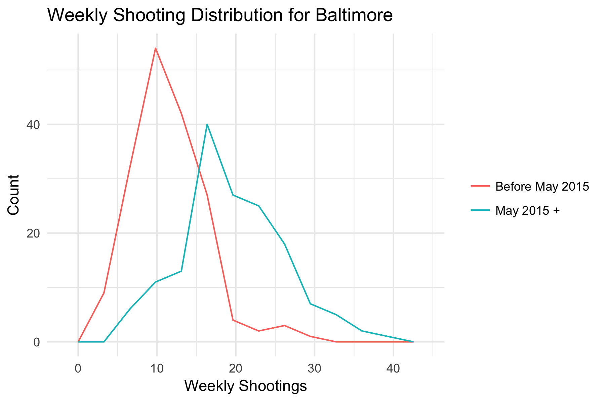

# Baltimore Shootings and Weather

This is a quick analysis to show the impact of weather on the number of shootings (non-fatal + homicides) in Baltimore, MD.

Using a regression model for a Poisson distribution, results suggest a 11% increase in the number of weekly total shootings for every 10 degree Farhenheit increase in the average daily maximum temperature for the week.

.")