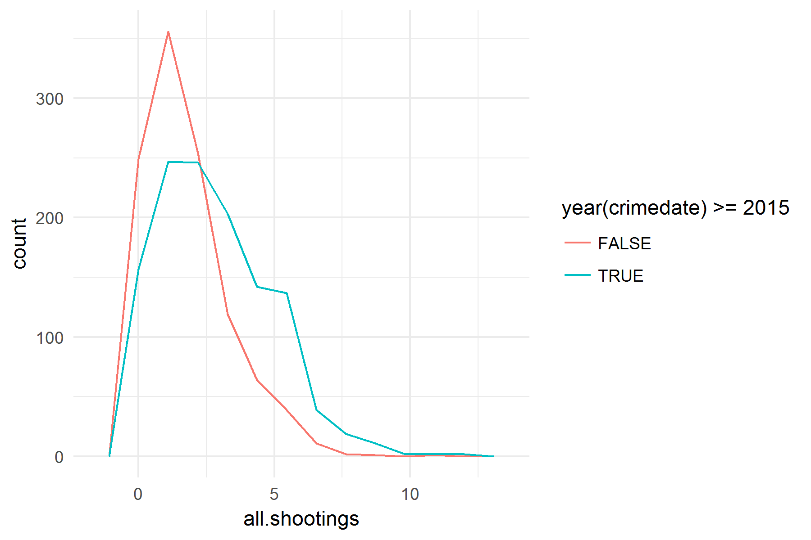

# Baltimore Shootings and Weather

This is a quick analysis to show the impact of weather (daily median outdoor temperature) on the number of daily shootings (non-fatal + homicides) in Baltimore, MD.

Using a regression model for a Poisson distribution, results suggest a 12% increase in the number of daily total shootings for every 10 degree Farhenheit increase in the daily median outdoor temperature.

.")